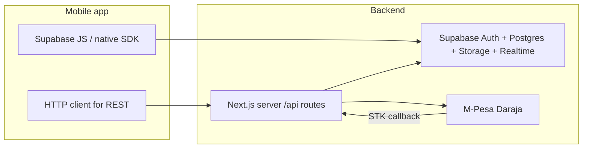

# Mobile integration guide — Tamagn Marketing backend

This document is for **iOS, Android, React Native, Flutter**, or any HTTP client that will talk to the same backend as the web app: **Supabase** (auth + database + storage + realtime) plus a small set of **Next.js Route Handlers** under `/api/*` for M-Pesa, escrow release, and admin logistics.

**Source of truth in repo:** `types/database.ts` (generated from Postgres), `app/api/**/route.ts`, `lib/mpesa.ts`, `lib/supabase/*`.

---

## Table of contents

1. [What you need from the team](#1-what-you-need-from-the-team)
2. [Architecture at a glance](#2-architecture-at-a-glance)
3. [Supabase — primary integration (recommended)](#3-supabase--primary-integration-recommended)
4. [REST API — Next.js `/api/*`](#4-rest-api--nextjs-api)
5. [Payments, escrow, and order lifecycle](#5-payments-escrow-and-order-lifecycle)
6. [Enums and domain reference](#6-enums-and-domain-reference)
7. [Realtime (optional)](#7-realtime-optional)
8. [Stub routes — do not use in production](#8-stub-routes--do-not-use-in-production)
9. [Security checklist](#9-security-checklist)
10. [Troubleshooting](#10-troubleshooting)

---

## 1. What you need from the team

| Item | Purpose |
|------|---------|
| `NEXT_PUBLIC_SUPABASE_URL` | Supabase project URL |
| `NEXT_PUBLIC_SUPABASE_ANON_KEY` | Public anon key (safe in mobile app **only** with RLS; never ship service role) |
| `NEXT_PUBLIC_APP_URL` | Web/API origin, e.g. `https://api.example.com` (used to build links; REST base URL) |
| Confirm **RLS policies** | Your mobile user must be allowed to `select`/`insert`/`update` the same rows as the web app for each role |

**Never** put `SUPABASE_SERVICE_ROLE_KEY`, M-Pesa secrets, or `MPESA_CALLBACK_SECRET` in a mobile binary.

---

## 2. Architecture at a glance



| Layer | Responsibility |
|-------|----------------|
| **Supabase** | Email/password auth, sessions, almost all **reads/writes** to `products`, `orders`, `profiles`, `wishlist_items`, etc., subject to RLS |
| **Next.js `/api/*`** | **M-Pesa STK**, **STK callback** (Safaricom → server), **escrow B2C release**, **logistics track / assign-courier** — implemented in code |
| **Web server actions** | Checkout, wishlist, etc. on web — **not** HTTP APIs; mobile should use Supabase + the REST routes below instead of duplicating server actions |

---

## 3. Supabase — primary integration (recommended)

### 3.1 Install and configure the client

Use the official client for your stack:

- **JavaScript / TypeScript / React Native:** `@supabase/supabase-js`
- **Flutter:** `supabase_flutter`
- **Swift:** Supabase Swift client
- **Kotlin:** Supabase Kotlin client

Initialize with:

- **URL:** `NEXT_PUBLIC_SUPABASE_URL`
- **Anon key:** `NEXT_PUBLIC_SUPABASE_ANON_KEY`

Enable **session persistence** (secure storage on device) and **automatic token refresh** so long-lived sessions work like the web.

### 3.2 Authentication (matches web validation rules)

The web validates sign-in and sign-up in `lib/validations/auth.ts`. Align your mobile forms with:

**Sign in**

| Field | Rules |
|-------|--------|
| `email` | Non-empty, valid email |
| `password` | Non-empty |

Use Supabase: `signInWithPassword({ email, password })`.

**Sign up**

| Field | Rules |
|-------|--------|
| `email` | Non-empty, valid email |
| `password` | 6–128 characters |
| `full_name` | Optional; max 200 characters (stored in `user_metadata` / profile flow as on web) |

Use Supabase: `signUp({ email, password, options: { data: { full_name } } })` (same idea as `app/actions/auth.ts`).

If email confirmation is enabled in the Supabase project, new users may need to confirm email before `signInWithPassword` succeeds.

### 3.3 User identity and profiles

- **Auth user id:** `auth.users.id` — UUID string.
- **App profile:** table `profiles` — one row per user, keyed by `profiles.id` = auth user id.

Important columns for payments and roles:

| Column | Type | Notes |
|--------|------|--------|
| `role` | enum | `buyer` \| `merchant` \| `service_provider` \| `admin` \| `courier` |
| `merchant_id` | uuid \| null | Set when user is a merchant |
| `service_provider_id` | uuid \| null | Set when user is a service provider |
| `phone` | text \| null | General contact |
| `mpesa_msisdn` | text \| null | Preferred for M-Pesa STK if set |
| `full_name`, `avatar_url` | | Display |

**M-Pesa STK** server logic uses `mpesa_msisdn` first, then falls back to `phone`. Ensure buyers have a valid MSISDN before calling `/api/payments/mpesa-stkpush`.

### 3.4 Key tables for mobile features (high level)

Use `types/database.ts` for exact column types. Common tables:

| Table | Typical use |
|-------|-------------|
| `categories` | Browse product/service categories (`kind`: `product` \| `service`) |
| `products`, `product_images` | Catalog; `price` is **string** (decimal); `status`: `draft` \| `active` \| `suspended` |
| `merchants` | Store info, location |
| `orders`, `order_items` | Orders; `status` is `order_status` enum; money fields are **strings** |
| `payments` | Payment rows (often updated after STK callback on server) |
| `delivery_assignments`, `delivery_events` | Logistics |
| `service_listings`, `service_requests` | Services marketplace |
| `wishlist_items` | Buyer wishlist |
| `promotions` | Merchant boosts; `status` includes workflow for payment (see server code) |
| `disputes` | Can block escrow release |

**Money:** Store as string decimals in DB (e.g. `"1999.50"`). Parse carefully in the client to avoid floating-point errors.

**Images:** Public URLs follow:

`{NEXT_PUBLIC_SUPABASE_URL}/storage/v1/object/public/{bucket}/{path}`

(see `lib/storage-url.ts` on the web; build the same URL in mobile for public buckets.)

### 3.5 Row Level Security (RLS)

All mobile queries use the **anon key** and the **user’s JWT**. Policies must allow:

- Buyers to read/write their orders, addresses, wishlist, etc.
- Merchants to manage their `products` and see their `orders` as defined in your migrations.

If something works in the Supabase SQL editor as `postgres` but fails in the app, it is almost always **RLS**. Fix policies in Supabase, not by embedding the service role in the app.

---

## 4. REST API — Next.js `/api/*`

**Base URL:** `{NEXT_PUBLIC_APP_URL}` with **no** trailing slash on the origin. Example:

`https://your-domain.com/api/payments/mpesa-stkpush`

### 4.1 Conventions

| Item | Value |
|------|--------|
| Request body | `Content-Type: application/json` for `POST` bodies |
| Success shape | Many routes use `{ "ok": true, ... }` |
| Error shape | Often `{ "ok": false, "error": "Human-readable message" }` with 4xx/5xx |
| Charset | UTF-8 |

### 4.2 Authentication (critical for mobile)

Implemented routes use the Supabase **server** client with **cookies** (`lib/supabase/server.ts`). The web stores the Supabase session in cookies.

**Implications:**

- A **standalone native app** that only sends `Authorization: Bearer <access_token>` **does not** automatically authenticate these routes **unless** the backend is extended to read the JWT from the header.
- Practical options today:
  1. **Prefer Supabase-only** for everything that does not require these endpoints; implement checkout/payment triggers via **Edge Functions** or **extend Next.js** to accept Bearer tokens.
  2. **Embedded WebView** login on the same domain so cookies are set, then call `/api/*` from a context that sends cookies (limited and fragile).
  3. **Backend change:** add a small helper that creates `createServerClient` with a custom `getSession` from `Authorization` header — coordinate with the web team.

Until Bearer (or equivalent) is implemented, treat **cookie-based** session as the assumed mechanism in production for these routes.

### 4.3 Endpoint reference

#### `POST /api/payments/mpesa-stkpush`

Buyer pays for an order via STK Push.

| | |
|--|--|
| **Auth** | Logged-in **buyer**; must be `orders.buyer_id` |
| **Body** | `{ "orderId": "<uuid>" }` |
| **Preconditions** | Order `status === "awaiting_payment"`; profile has `mpesa_msisdn` or `phone` |

**Success — HTTP 200**

```json
{
  "ok": true,
  "checkoutRequestId": "ws_CO_...",
  "merchantRequestId": "...",
  "customerMessage": "Success. Request accepted for processing"
}
```

**Errors (examples)**

```json
{ "ok": false, "error": "Unauthorized" }
```

HTTP 401 — no session.

```json
{ "ok": false, "error": "orderId required" }
```

HTTP 400.

```json
{ "ok": false, "error": "Forbidden" }
```

HTTP 403 — not the buyer.

```json
{ "ok": false, "error": "Order not awaiting payment" }
```

HTTP 400.

```json
{ "ok": false, "error": "Add M-Pesa number in buyer profile" }
```

HTTP 400 — set `profiles.mpesa_msisdn` or `phone`.

```json
{ "ok": false, "error": "...", "response": { } }
```

HTTP 502 — Daraja/STK failure; `response` may contain provider payload.

**Server side effects:** Updates `orders.mpesa_checkout_request_id`; inserts `payments` with `status` pending.

---

#### `POST /api/payments/mpesa-stkpush-promotion`

Merchant pays for a **promotion** (boost).

| | |
|--|--|
| **Auth** | Logged-in user whose `profiles.merchant_id` is set |
| **Body** | `{ "promotionId": "<uuid>" }` |
| **Preconditions** | Promotion exists, belongs to merchant, `status` allows payment (server checks `"pending"`) |

**Success — HTTP 200**

```json
{
  "ok": true,
  "checkoutRequestId": "...",
  "merchantRequestId": "...",
  "customerMessage": "..."
}
```

**Typical errors:** `401`, `403` (not a merchant or wrong merchant), `404`, `400` (`promotionId required`, not payable, invalid amount, missing phone), `502`.

---

#### `POST /api/payments/mpesa-callback`

**Caller:** **Safaricom servers only** — not the mobile app.

| | |
|--|--|
| **Purpose** | Receive STK result; update escrow and promotion state in DB |
| **Optional auth** | If `MPESA_CALLBACK_SECRET` is set in server env, requests must include header `x-mpesa-callback-secret: <same value>` |

**Responses** (Safaricom expects JSON; some paths always return 200 with `ResultCode`):

- Success processing: `{ "ResultCode": 0, "ResultDesc": "Success" }`
- Ignored callback (no checkout id): `{ "ResultCode": 0, "ResultDesc": "Ignored" }`
- Bad JSON: `{ "ResultCode": 1, "ResultDesc": "Bad JSON" }`
- Wrong secret: HTTP 401 `{ "ResultCode": 1, "ResultDesc": "Unauthorized" }`

**Mobile:** Do not call this. Ensure production `MPESA_CALLBACK_URL` is **HTTPS** and publicly reachable.

---

#### `POST /api/payments/release`

Releases escrow via **M-Pesa B2C** to the resolved payee (merchant or service provider per server logic).

| | |
|--|--|
| **Auth** | Order **buyer** (`orders.buyer_id === user.id`) **or** `profiles.role === "admin"` |
| **Body** | `{ "orderId": "<uuid>" }` |
| **Preconditions** | `order.status === "completed"`; `escrow_released === false`; no active dispute |

**Success — HTTP 200**

```json
{
  "ok": true,
  "data": { }
}
```

`data` is provider-dependent raw payload from B2C initiation.

**Errors**

| HTTP | `error` (typical) |
|------|-------------------|
| 400 | `orderId required`, `Order not eligible for release`, payout target errors |
| 401 | `Unauthorized` |
| 403 | `Forbidden` |
| 404 | `Order not found` |
| 409 | `Escrow frozen: active dispute` |
| 500 | `Server configuration` |
| 502 | B2C failure; may include `data` |

---

#### `GET /api/logistics/track`

Delivery timeline for an order.

| | |
|--|--|
| **Auth** | Logged-in user |
| **Query** | `orderId` — required, UUID string |

**Example:** `GET /api/logistics/track?orderId=xxxxxxxx-xxxx-xxxx-xxxx-xxxxxxxxxxxx`

**Success — HTTP 200**

```json
{
  "ok": true,
  "assignment": {
    "id": "...",
    "status": "...",
    "created_at": "2025-01-01T12:00:00.000Z"
  },
  "events": [
    { "event_type": "assigned", "created_at": "2025-01-01T12:05:00.000Z" }
  ]
}
```

If there is no row in `delivery_assignments` for the order:

```json
{
  "ok": true,
  "assignment": null,
  "events": []
}
```

**Errors:** `400` (`orderId required`), `401`, `404` (order missing).

---

#### `POST /api/logistics/assign-courier`

**Admin only:** assigns a courier to an order.

| | |
|--|--|
| **Auth** | `profiles.role === "admin"` |
| **Body** | `{ "orderId": "<uuid>", "courierUserId": "<uuid>" }` |

**Success — HTTP 200**

```json
{ "ok": true, "assignmentId": "<uuid>" }
```

**Errors:** `400` (missing fields or business rule from `assignCourierToOrder`), `401`, `403`, `500`.

---

### 4.4 Quick matrix (implemented routes)

| Method | Path | Auth | Body / query |
|--------|------|------|----------------|
| `POST` | `/api/payments/mpesa-stkpush` | Buyer session | `{ "orderId" }` |
| `POST` | `/api/payments/mpesa-stkpush-promotion` | Merchant session | `{ "promotionId" }` |
| `POST` | `/api/payments/mpesa-callback` | Safaricom (+ optional secret) | Daraja JSON |
| `POST` | `/api/payments/release` | Buyer or admin | `{ "orderId" }` |
| `GET` | `/api/logistics/track` | Session | `?orderId=` |
| `POST` | `/api/logistics/assign-courier` | Admin | `{ "orderId", "courierUserId" }` |

---

## 5. Payments, escrow, and order lifecycle

### 5.1 Order statuses (`order_status`)

Use these exact strings in app logic and when reading `orders.status`:

1. `awaiting_payment` — buyer must pay (STK).
2. `paid_escrow` — paid into escrow (after successful callback processing).
3. `merchant_confirmed` → `pickup_scheduled` → `collected` → `in_transit` → `delivered` — logistics progression (exact transitions depend on your app/server updates).
4. `completed` — buyer confirmed receipt; **then** escrow can be released via `/api/payments/release` if rules pass.
5. `cancelled` — cancelled.
6. `disputed` — dispute open; release may be blocked (`409` on release).

### 5.2 Suggested buyer payment flow (mobile)

1. Create order in Supabase (or your flow) so `status` is `awaiting_payment` and `total` is correct.
2. Ensure `profiles.mpesa_msisdn` or `phone` is set (MSISDN rules — server uses `normalizeMsisdn` in `lib/mpesa.ts`: Kenya `254`, strips leading `0`, etc.).
3. `POST /api/payments/mpesa-stkpush` with `orderId`.
4. User completes PIN on phone; Safaricom hits `/api/payments/mpesa-callback`; your DB updates (escrow module).
5. Subscribe to `orders` row changes (realtime) or poll `orders.status` until `paid_escrow` or failure.
6. After delivery and `completed`, eligible buyer or admin calls `/api/payments/release`.

### 5.3 Phone number hints (server-side normalization)

The server normalizes numbers for Daraja (see `normalizeMsisdn`). Prefer storing **international** format without `+` (e.g. `2547xxxxxxxx` for Kenya) to match `MPESA_MSISDN_COUNTRY_CODE`.

---

## 6. Enums and domain reference

Copied from `types/database.ts` for convenience — **regenerate types** if schema changes.

**`profiles.role` / `user_role`:** `buyer` | `merchant` | `service_provider` | `admin` | `courier`

**`product_status`:** `draft` | `active` | `suspended`

**`order_type`:** `product` | `service`

**`payment_status`:** `pending` | `completed` | `failed` | `refunded`

**`category_kind`:** `product` | `service`

**`promotion_type`:** `store` | `product` | `featured_merchant`

**`service_request_status`:** `pending` | `accepted` | `declined` | `completed` | `cancelled`

**`application_status`:** `pending` | `approved` | `rejected`

**`dispute_status`:** `open` | `under_review` | `resolved` | `closed`

**`dispute_outcome`:** `pending` | `release_to_merchant` | `refund_buyer` | `partial_refund`

---

## 7. Realtime (optional)

The web uses Supabase Realtime on table `public.orders` with filter `id=eq.{orderId}` to refresh when an order row changes (see `hooks/useOrderRealtime.ts`).

**Enable:** Supabase Dashboard → Database → **Publications** — include `orders` for `postgres_changes` if you want the same behavior on mobile.

**Channel naming:** arbitrary; web uses `order-live-{orderId}`.

---

## 8. Stub routes — do not use in production

These return **placeholder** JSON and **do not** load or persist real data. Use **Supabase** instead until implemented.

| Method | Path | Sample response |
|--------|------|-----------------|
| `POST` | `/api/auth/login` | `{ "ok": true }` |
| `POST` | `/api/auth/signup` | `{ "ok": true }` |
| `POST` | `/api/auth/role` | `{ "ok": true }` |
| `GET` | `/api/products/list` | `{ "items": [] }` |
| `POST` | `/api/products/create` | `{ "ok": true }` |
| `GET` | `/api/products/[id]` | `{ "id": "..." }` |
| `PATCH` | `/api/products/[id]` | `{ "id": "...", "updated": true }` |
| `DELETE` | `/api/products/[id]` | `{ "id": "...", "deleted": true }` |
| `GET` | `/api/categories/list` | `{ "items": [] }` |
| `POST` | `/api/categories/create` | `{ "ok": true }` |
| `GET` | `/api/orders/list` | `{ "items": [] }` |
| `POST` | `/api/orders/create` | `{ "ok": true }` |
| `POST` | `/api/orders/confirm` | `{ "ok": true, "escrowReleased": true }` |

---

## 9. Security checklist

- Ship only **`NEXT_PUBLIC_*`** keys that are designed for clients; **anon** key + RLS is the model.
- Never log access or refresh tokens in production analytics as plain text.
- Use **certificate pinning** only if your security team requires it; always use **HTTPS** for `NEXT_PUBLIC_APP_URL` in production.
- M-Pesa callbacks: protect with `MPESA_CALLBACK_SECRET` and HTTPS.
- Validate all UUIDs and numeric inputs on the client for UX; **RLS** is the real enforcement.

---

## 10. Troubleshooting

| Symptom | Likely cause |
|---------|----------------|
| Supabase queries return empty or permission denied | RLS policy or missing JWT / expired session |
| `/api/*` always 401 | No cookie session; see [§4.2](#42-authentication-critical-for-mobile) |
| STK succeeds but order never updates | Callback URL not reachable, wrong env, or escrow handler error — check server logs |
| `Add M-Pesa number in buyer profile` | `mpesa_msisdn` and `phone` both empty or invalid |
| Release returns 409 | Active dispute on order |
| Realtime never fires | Replication not enabled for `orders` |

---

## Related files in the repository

| Topic | Path |
|-------|------|
| DB types | `types/database.ts` |
| Order status (app) | `types/order.ts` |
| Auth validation rules | `lib/validations/auth.ts` |
| M-Pesa | `lib/mpesa.ts`, `lib/mpesa/config.ts` |
| Delivery timeline | `lib/queries/delivery.ts` |
| API routes | `app/api/**/route.ts` |
| Env template | `.env.example` |

Update this document when you add Bearer auth for `/api/*`, new routes, or schema changes.
